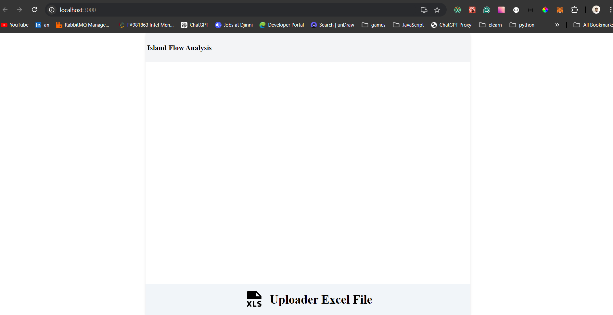
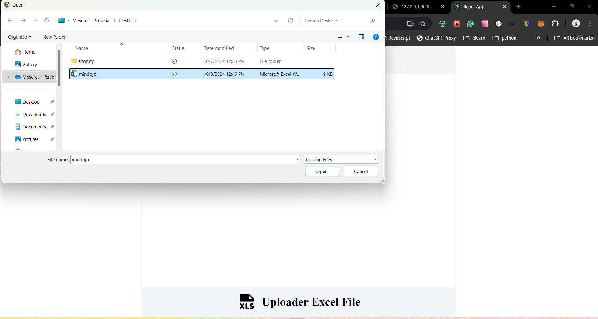
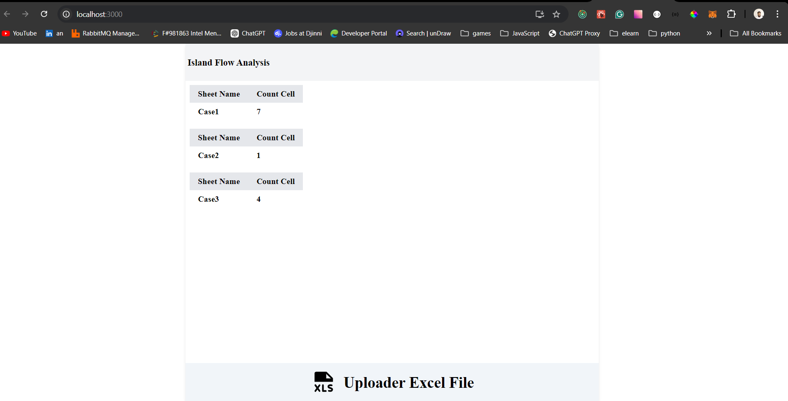

# Mindojo Full stack assessment

This assessment is created with Docker container and Manual installation as well. Mainly the project is divided into 2 projects. These are backend and Frontend

2. Frontend

   This project is created using React typescript and tailwind CSS for CSS style. This project's main purpose is to visualize what is happening and to display the result. Seeing is believing that is what it does

   ## How to run the project

   You can run this project with two ways of method. These are **Docker** and **Manual installation**

   **Note**

   please change all **.env.example** file into **.env**. After changing please provide your API key with your own API key

   ### 1. Docker installation

   #### Prerequisites

   Before you begin, ensure you have the following installed on your machine:

   - [Docker](https://www.docker.com/get-started)
   - [Docker Compose](https://docs.docker.com/compose/install/)

   1. clone the repository

      ```bash
      https://github.com/messyKassaye/mindojo
      ```

   2. build Docker image

      ```base
      docker-compose build
      ```

   3. Start the application
      ```base
      docker-compose up
      ```

   ### 1. Manual installation

   ## 1. How to run **Backend**

   #### Prerequisites

   you need to have python on your machine. if you don't have it you can install at below link and configure with your machine like environment variable for Window system

   - [Python](https://www.python.org/)

   After installing Python or if you already installed python previously. you go ahead with the following commands

   1. Create Virtual environment for this project

      ```base
      python -m venv .venv
      ```

   2. activate your virtual environment

      for windows

      ```base
      .\.venv\Scripts\activate
      ```

      for MAC and Linux

      ```base
      source .\.venv\Scripts\activate

      ```

   3. Install dependencies
      all dependencies are place inside requirements.txt file

      ```base
      pip install -r requirements.txt
      ```

   4. finally we can start FastAPI server using Uvicorn
      ```base
      uvicorn app.main:app --reload
      ```
   5. Finally open your browser and paster below command
      ```base
      http://localhost:8000
      ```

## 2. How to run Frontend

#### Prerequisites

To install this backend project you need to have install nodeJS to your machine. To install it please download node from below link

- [NodeJS](https://nodejs.org/en)

## 1. install dependencies

```base
npm install
```

sometime you may get peer dependencies issue. so please run the below command if you this err

```base
npm install --legacy-peer-deps
```

## 2. run the project

```base
npm start
```

## 6. Finally open your browser and paster below command

```base
   http://localhost:3000
```

### finally output






